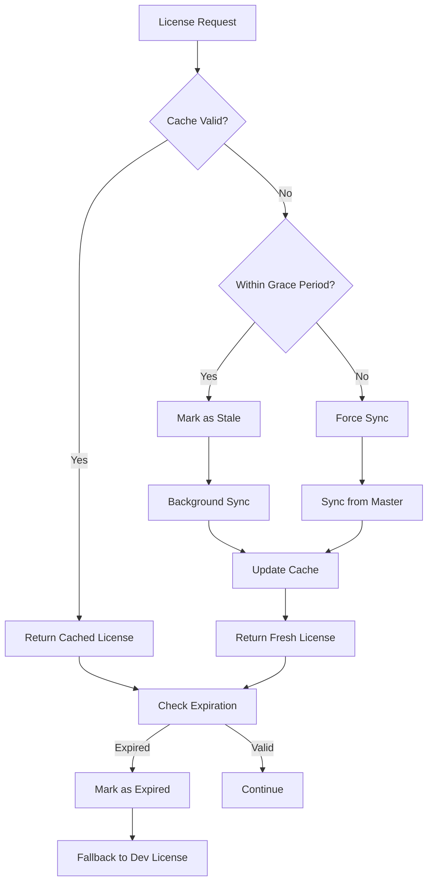

# License Cache Management System

## Overview

The license cache management system ensures reliable license validation while maintaining performance and handling network failures gracefully. This system is critical for production environments where license validation must be both fast and reliable.

## Architecture

### Master-Slave Model

- **Master Server**: Single source of truth for license data
- **Slave Server**: Caches license data locally for fast access
- **Real-time Sync**: WebSocket-based updates when licenses change
- **Fallback Mechanism**: Graceful degradation when master is unavailable

## Cache Configuration

### Environment Variables

```bash
# Cache TTL (Time To Live)
LICENSE_CACHE_TTL=1800000          # 30 minutes (default)
STALE_GRACE_PERIOD=7200000         # 2 hours (default)

# Sync Settings
BACKGROUND_SYNC_INTERVAL=900000    # 15 minutes (default)
MAX_SYNC_RETRIES=3                 # Maximum retry attempts
SYNC_RETRY_DELAY=5000              # 5 seconds between retries
SYNC_TIMEOUT=10000                 # 10 seconds network timeout

# Cleanup Settings
CLEANUP_INTERVAL=3600000           # 1 hour (default)
FAILED_CACHE_MAX_AGE=86400000      # 24 hours (default)

# Feature Flags
ENABLE_CACHE=true                  # Enable/disable caching
ENABLE_BACKGROUND_SYNC=true        # Enable/disable background sync
ENABLE_CACHE_CLEANUP=true          # Enable/disable cleanup service
```

### Environment-Specific Settings

#### Development

- Shorter TTLs for faster iteration
- More frequent syncs for testing
- Aggressive cleanup

#### Production

- Longer TTLs for stability
- Less frequent syncs to reduce load
- Conservative cleanup

## Cache States

### 1. **Synced** ✅

- License data is fresh and valid
- Last sync was within TTL
- All features are available

### 2. **Stale** ⚠️

- License data is older than TTL
- Still usable within grace period
- Background sync is triggered
- Features remain available

### 3. **Failed** ❌

- Sync attempts have failed
- License may be expired or invalid
- System falls back to development license
- Limited features available

### 4. **Expired** 🚫

- License has passed expiration date
- No features available
- Requires immediate sync or new license

## Cache Lifecycle



## Production Considerations

### 1. **High Availability**

- **Grace Period**: 2-4 hours of stale cache usage
- **Retry Logic**: Automatic retry with exponential backoff
- **Fallback License**: Development license when all else fails

### 2. **Performance**

- **TTL Optimization**: Balance between freshness and performance
- **Background Sync**: Non-blocking license updates
- **Cache Warming**: Pre-load licenses on startup

### 3. **Security**

- **Fingerprint Validation**: Server identity verification
- **Token Expiration**: Automatic session cleanup
- **Access Control**: Feature-based authorization

### 4. **Monitoring**

- **Cache Hit Rate**: Monitor cache effectiveness
- **Sync Success Rate**: Track master server availability
- **License Expiration**: Alert before licenses expire

## Error Handling

### Network Failures

```javascript
// Retry with exponential backoff
if (response.status >= 500 || response.status === 429) {
  if (retryCount < MAX_SYNC_RETRIES) {
    await delay(SYNC_RETRY_DELAY * Math.pow(2, retryCount));
    return syncLicenseFromMaster(retryCount + 1);
  }
}
```

### Authentication Failures

- **401 Errors**: Invalid API keys or tokens
- **403 Errors**: Insufficient permissions
- **Fallback**: Use cached data within grace period

### Data Corruption

- **Validation**: Check license data integrity
- **Recovery**: Re-sync from master server
- **Cleanup**: Remove corrupted cache entries

## Monitoring and Alerts

### Key Metrics

1. **Cache Hit Rate**: Should be > 90%
2. **Sync Success Rate**: Should be > 95%
3. **License Expiration**: Alert 7 days before expiry
4. **Grace Period Usage**: Should be < 5% of requests

### Health Checks

```bash
# Check cache status
GET /api/licenses/current

# Check sync status
GET /api/licenses/sync-status

# Manual sync trigger
POST /api/licenses/manual-sync
```

## Troubleshooting

### Common Issues

#### 1. **Stale Cache**

```bash
# Symptoms: Features not updating
# Solution: Trigger manual sync
curl -X POST http://localhost:8004/api/licenses/manual-sync
```

#### 2. **Authentication Failures**

```bash
# Symptoms: 401 errors in logs
# Solution: Check SECRET_INTERNAL_API_KEY
echo $SECRET_INTERNAL_API_KEY
```

#### 3. **Network Timeouts**

```bash
# Symptoms: Sync timeouts
# Solution: Increase timeout or check network
export SYNC_TIMEOUT=30000
```

#### 4. **Cache Corruption**

```bash
# Symptoms: Invalid license data
# Solution: Clear cache and re-sync
# (Implemented in cleanup service)
```

## Best Practices

### 1. **Configuration**

- Use environment-specific settings
- Monitor cache performance
- Set appropriate TTLs for your use case

### 2. **Monitoring**

- Implement health checks
- Set up alerts for critical failures
- Monitor cache hit rates

### 3. **Maintenance**

- Regular cache cleanup
- Monitor disk usage
- Review sync logs

### 4. **Security**

- Rotate API keys regularly
- Monitor access patterns
- Implement rate limiting

## Migration Guide

### From Old System

1. **Backup**: Export current license data
2. **Deploy**: Install new cache system
3. **Migrate**: Import license data
4. **Verify**: Test cache functionality
5. **Monitor**: Watch for issues

### Configuration Changes

```bash
# Old settings
LICENSE_CACHE_TTL=3600000

# New settings
LICENSE_CACHE_TTL=1800000
STALE_GRACE_PERIOD=7200000
BACKGROUND_SYNC_INTERVAL=900000
```

## Conclusion

The cache management system provides:

- **Reliability**: Graceful handling of network failures
- **Performance**: Fast license validation
- **Scalability**: Efficient resource usage
- **Maintainability**: Clear monitoring and debugging

For production deployments, ensure proper monitoring and alerting are in place to maintain system health and performance.
